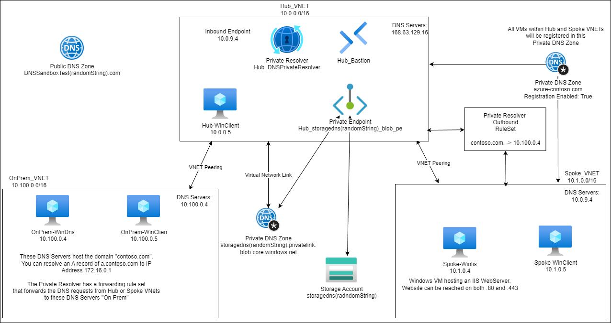

# Lab environment for most Azure DNS scenarios

## Scenarios

Azure DNS Zone (Public) - non delegated  
Azure Private DNS Zone - for a Storage Account Private Endpoint  
Azure Private DNS Zone - for registering the VMs in two VNETs  
Azure DNS Private Resolver - Inbound is configured, but none of the VNETs have it configured for use  
Azure DNS Private Resolver - Outbound is configured to send queries for contoso.com to DNS Servers "On Prem" (Azure VMs in a VPN connected VNET)

## Virtual Machines

All Virtual Machines are running Windows Server 2022 with the following installed via Chocolatey:  

 - Wireshark
 - PowerShell Core
 - Windows Terminal
 - Visual Studio Code
 - Python3

Hub and Spoke Virtual Machines can be accessed via Bastion.

OnPrem-WinDns0 and OnPrem-WinDns1 are running as DNS Servers.  
They are hosting zone "contoso.com." with an A Record of "a" that resolves to 172.16.0.1  

Hub-WinDns0 and Hub-WinDns1 are running as DNS Servers.  
They are forwarding all queries received to 168.63.129.16

Spoke-WinIis is running as a Web Server.
The Website can be reached at https://spoke-winiis.azure-contoso.com from either the Hub DNS Virtual Machines.  
Note: The domain name will change if you alter the parameter "privateDNSZone_Name".

## Deployment and Infrastructure

The link below can be used to quickly deploy the lab directly to your subscription.

Below is a diagram of the infrastructure

