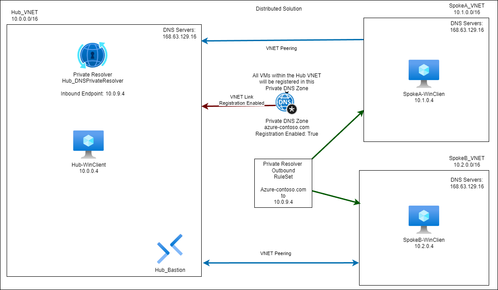

# Sandbox Environment for Azure DNS Private Resolver utilizing a Distributed DNS Architecture

## Deployment

The link below can be used to quickly deploy the lab directly to your subscription.

## Scenario

Azure DNS Private Resolver - [Distributed DNS Architecture](https://learn.microsoft.com/en-us/azure/dns/private-resolver-architecture#distributed-dns-architecture)

## Infrastructure

Diagram of the infrastructure

