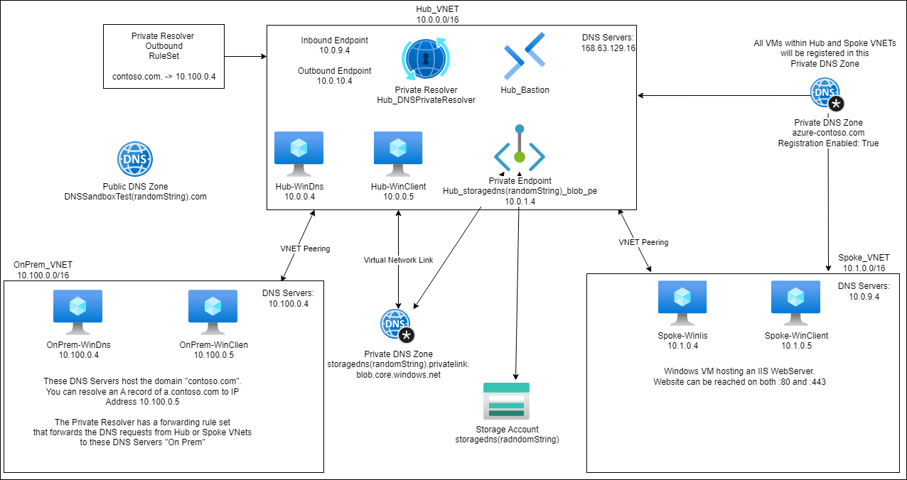

# Lab environment for most Azure DNS scenarios

## Deployment

The link below can be used to quickly deploy the lab directly to your subscription.

[](https://portal.azure.com/#create/Microsoft.Template/uri/https%3A%2F%2Fraw.githubusercontent.com%2Fjimgodden%2FAzure_Networking_Labs%2Fmain%2FDeployment_Sandbox%2FDNS%2Fsrc%2Fmain.json)

## Scenarios

Azure DNS Zone (Public) - non delegated  
Azure Private DNS Zone - for a Storage Account's Private Endpoint  
Azure Private DNS Zone - for registering the VMs in the 'Azure Virtual Networks'  
Azure DNS Private Resolver - [Centralized DNS Architecture](https://learn.microsoft.com/en-us/azure/dns/private-resolver-architecture#centralized-dns-architecture)

## Azure DNS Zone (Public) - non delegated

### Resources
- DNS Zone

### Explanation
Creates a DNS Zone with the following name: 'DNSSandboxTest${uniqueString(resourceGroup().id)}.com'  
Note: ${uniqueString(resourceGroup().id)} will be a randomly generated string based on the Resource Group name.  

You will not be able to resolve this DNS Zone via the usual public DNS Servers like 1.1.1.1 since the DNS Zone is not delegated from a DNS provider such as GoDaddy or CloudFlare.  Instead, you can resolve the DNS Zone by specifying one of the Name Servers listed in the DNS Zone's Portal page.   

Below is an example of resolving the DNS Zone via one of the default provided Name Servers.

DNS Zone: AzureNetworkTest.com  

Name server 1: ns1-37.azure-dns.com.  
Name server 2: ns2-37.azure-dns.net.  
Name server 3: ns3-37.azure-dns.org.  
Name server 4: ns4-37.azure-dns.info.  

### PowerShell
```
PS C:\> Resolve-DNSName -Name AzureNetworkTest.com -Server ns1-37.azure-dns.com.

Name                        Type TTL   Section    PrimaryServer               NameAdministrator           SerialNumber
----                        ---- ---   -------    -------------               -----------------           ------------
AzureNetworkTest.com        SOA  300   Authority  ns1-37.azure-dns.com        azuredns-hostmaster.microso 1
```

## Azure Private DNS Zone - for a Storage Account's Private Endpoint 

### Resources
- Private DNS Zone
  - Name: privatelink.blob.windows.core.net
- Storage Account
  - Name: storagedns(randomString)
- Private Endpoint - Blob
  - Name: Hub_storagedns(randomString)_blob_pe
  - IP Address: 10.0.1.4

### Explanation

Creates a Private DNS Zone and links it to a Private Endpoint which can be used to access a Storage Account.

## Azure Private DNS Zone - for registering the VMs in the 'Azure Virtual Networks' 

### Resources
- Private DNS Zone
  - Name: azure-contoso.com
- Linked Virtual Networks - Registration Enabled
  - Hub_VNet
  - Spoke_VNet

### Explanation

The Private DNS Zone 'azure-contoso.com' will be linked and registered to the Virtual Networks listed above.  This will create A records for all Virtual Machines in those Virtual Networks in the Private DNS Zone and allow for the FQDNs of the Virtual Machines to be resolved to their IP Addresses.

## Azure DNS Private Resolver - Centralized DNS Architecture

### Resources
- Private DNS Resolver
  - Inbound Endpoint
    - IP Address: 10.0.9.4
  - Outbound Endpoint
    - RuleSet
      - Forwards requests to contoso.com to the 'On Prem' DNS Server.

### Explanation

Configures a solution involving using a DNS Private Resolver where:  

- 'On Prem' DNS Servers conditionally forward queries for Private DNS Zones to the Private Resolver.
- Virtual Machines within the 'Azure Virtual Networks' forward queries to the Private Resolver's Inbound Endpoint for DNS Resolution.


## Virtual Machines

All Virtual Machines are running Windows Server 2022 with the following installed via Chocolatey:  

 - Wireshark
 - PowerShell Core
 - Windows Terminal
 - Visual Studio Code
 - Python3

Hub, Spoke, and On Prem Virtual Machines can be accessed via Bastion.

OnPrem-WinDns is running as a Windows DNS Server.  
It is hosting zone "contoso.com." with an A Record that resolves to 10.100.0.5 

Hub-WinDns is running as a DNS Server.  However, nothing is configured to use it by default.  Can be swapped with the Private Resolver.  
It is forwarding all queries received to 168.63.129.16.

Spoke-WinIis is running as a Web Server.  
The Website can be reached at https://spoke-winiis.azure-contoso.com from either the Hub DNS Virtual Machines.  
Note: The domain name will change if you alter the parameter "privateDNSZone_Name".

All Virtual Machines with either Client or Clien in the name can be used for testing DNS and connectivity.

## Infrastructure

Below is a diagram of the infrastructure


