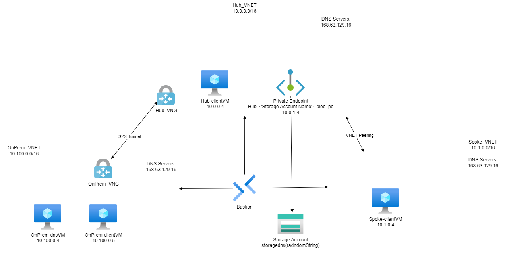

# Azure DNS Training Lab

## Deployment

The link below can be used to quickly deploy the lab directly to your subscription.

Average time to deploy: 45 minutes

## Learning Outcomes

### Private DNS Zone  
- Create a Private DNS Zone  
- Link the Private DNS Zone to Virtual Networks
- Registering a Virtual Network to the Private DNS Zone

### DNS Private Resolver 
- Create a DNS Private Resolver
- Create an Inbound Endpoint
- Create an Outbound Endpoint
    - Create a Ruleset
        - Create a Rule
    - Link the Ruleset to a Virtual Network

### Windows DNS Server
- Configure a Windows 2022 Virtual Machine to operate as a DNS Server
- Configure the DNS Server to Forward to a another DNS Server
- Configure a Conditional Forwarder for resolving the Private IP Address of Private Endpoints

## Infrastructure

Diagram of the infrastructure

## Training Objectives

1. Configure OnPrem-WinDns as a custom Windows DNS Server
2. Create a Forwarder in the OnPrem-WinDns custom DNS Server for 168.63.129.16
3. Create a Forward Lookup Zone in the OnPrem-WinDns custom DNS Server for "contoso.com"
    1. Add an A Record for contoso.com with the value "10.100.0.6"
4. Create a Private DNS Zone named privatelink.blob.core.windows.net for the Storage Account's Blob Private Endpoint
    1. Link the Private DNS Zone to the Hub_VNET
    2. Link the Private Endpoint to the Private DNS Zone
5. Create a Private DNS Zone named "azure-contoso.com"
    1. Link the Private DNS Zone to the Hub_VNET and Spoke_VNET
        1. Enable registration for both VNETs listed above
6. Create a Private DNS Resolver in the Hub_VNET
    1. Create an Inbound Endpoint in the DNS Private Resolver in the PrivateResolver_Inbound subnet
    2. Create an Outbound Endpoint in the DNS Private Resolver in the PrivateResolver_Outbound subnet
        1. Within the Outbound Endpoint, create a rule to forward queries for contoso.com. to OnPrem-WinDns
7. Link the newly created outbound ruleset of the DNS Private Resolver to the Spoke_VNET
8. Create a Conditional Forwarder in the OnPrem-WinDns custom DNS Server for azure-contoso.com to forward to the Inbound Endpoint of the DNS Private Resolver
9. Create a Conditional Forwarder in the OnPrem-WinDns custom DNS Server for blob.core.windows.net to forward to the Inbound Endpoint of the DNS Private Resolver
10. Configure the OnPrem_VNET to use OnPrem-WinDns instead of Azure Default for DNS resolution.
11. Configure the Hub_VNET to use the Inbound Endpoint of the DNS Private Resolver instead of Azure Default for DNS resolution.
12. Configure the Spoke_VNET to use Inbound Endpoint of the DNS Private Resolver instead of Azure Default for DNS resolution.

After completing the steps above, you will need to restart the ClientVMs for them to get the correct DNS configurations.  
 
Once everything above is complete, you can validate by running the following PowerShell commands on both OnPrem-WinClien and Spoke-WinClient:

https://raw.githubusercontent.com/jimgodden/Azure_Networking_Labs/main/scripts/DNSTestScript.ps1
 
You should get the following result:

Result for Contoso.com: 10.100.0.6  
Result for Spoke-WinClient: 10.1.0.4  
Result for \<StorageAccountName\>.blob.core.windows.net: 10.0.1.4  
These Queries were run at $(Get-Date -AsUTC)  
